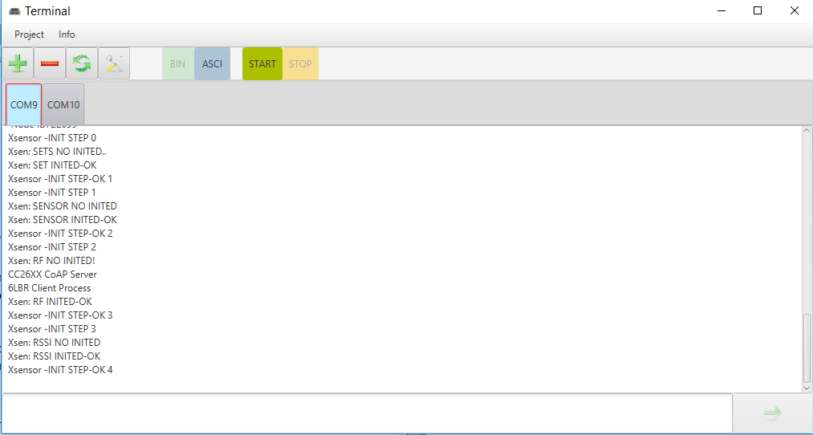

# Terminal_Serial_Java
Serial terminal

This is a simple terminal project for a serial port, on JavaFx
The main difference - behind each port, a separate tab is fixed!
It is more convenient than the traditional form

